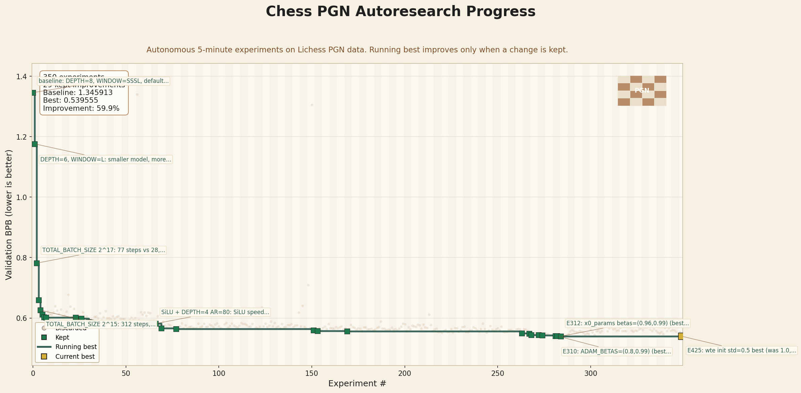

# autoresearch — Chess PGN

> Autonomous short-run research on chess PGN modeling.

This repository is a fork of [karpathy/autoresearch](https://github.com/karpathy/autoresearch), adapted for native Windows/NVIDIA use and currently focused on a chess-PGN research run built on Lichess game records.

Try a live game here: [chess-pi-wheat.vercel.app](https://chess-pi-wheat.vercel.app/).



## What This Repo Is Now

The active work in this repo is not a generic TinyStories run. It is an autonomous experimentation loop for chess PGN:

- `prepare.py` downloads and prepares Lichess PGN data and the tokenizer.
- `train.py` is the single file the agent edits.
- `program.md` defines the autonomous research loop.
- `results.tsv` records accepted and rejected experiments.

The training script runs on a fixed short budget, evaluates with `val_bpb` (validation bits per byte), and keeps only changes that improve the metric.

## Current Status

This branch has run hundreds of 5-minute chess experiments. The current logged baseline is `1.345913` and the current best logged result is `0.539555`, a roughly `59.9%` reduction in `val_bpb`.

What that means:

- The model has learned a lot about chess PGN structure and formatting.
- The current checkpoint can generate plausible PGN headers and opening sequences.
- The repo does **not** yet prove meaningful chess-playing strength.

Current evaluation limits:

- Primary metric is `val_bpb`.
- Qualitative checks include PGN-format sampling.
- There is no legality checker yet.
- There is no FEN-aware benchmark yet.
- There is no Stockfish or engine-based strength evaluation yet.

Public summary and charts:

- [Chess PGN progress writeup](chess-pgn-progress.md)
- [Chronology chart](progress.png)
- [Major improvements waterfall](progress-waterfall.png)
- [Category summary chart](progress-categories.png)

Benchmarking:

- `uv run eval_chess.py --dataset chesspgn --checkpoint <path-to-checkpoint.pt>`
- current benchmark focuses on legal next-move generation and continuation ranking from movetext-only prompts
- it is stronger than raw PGN sampling, but it is still not an engine-strength benchmark

## Why Chess PGN

Chess PGN is a good target for short autonomous runs because it is structured, repetitive, and information-dense. That makes it a useful domain for measuring whether an agent can improve a model quickly under a strict wall-clock budget.

This repo is therefore best understood as:

- a chess-PGN modeling experiment
- an autonomous research process experiment
- a Windows-friendly single-GPU fork of `autoresearch`

## Quick Start

**Requirements:** NVIDIA GPU, Python 3.10+, [uv](https://docs.astral.sh/uv/).

```powershell
# 1. Install dependencies
uv sync

# 2. Prepare the chess dataset and tokenizer
$env:AUTORESEARCH_CACHE_DIR = "h:/autoresearch/.cache"
uv run prepare.py --dataset chesspgn

# 3. Run a smoke test
uv run train.py --dataset chesspgn --smoke-test

# 4. Run a full 5-minute experiment
uv run train.py --dataset chesspgn
```

More setup details are in [docs/setup-and-usage.md](docs/setup-and-usage.md).

## Chess Benchmark

After training or loading a checkpoint, run:

```powershell
uv run eval_chess.py --dataset chesspgn --checkpoint checkpoint_pre_eval.pt
```

The benchmark reports:

- `legal_move_rate`
- `next_move_top1_accuracy`
- `next_move_top3_accuracy`
- `avg_legal_candidates`
- a few deterministic qualitative examples

This benchmark is board-aware and stronger than simple text sampling, but it still does not measure playing strength the way an engine match or Stockfish-based evaluation would.

## How The Loop Works

The workflow is intentionally narrow:

1. Start from the current best branch state.
2. Let the agent modify `train.py`.
3. Run a fixed-budget training experiment on chess PGN data.
4. Measure `val_bpb`.
5. Log the result in `results.tsv`.
6. Keep the change only if the metric improves.

This keeps the search comparable across runs and makes the experiment history easy to audit.

## Repository Layout

```text
prepare.py              data prep, tokenizer, dataloader, evaluation
train.py                model, optimizer, training loop; agent edits this
program.md              autonomous research instructions
results.tsv             experiment log
chess-pgn-progress.md   public writeup for the chess run
progress*.png           public charts summarizing the run
```

## Fork Scope

- Upstream source: [karpathy/autoresearch](https://github.com/karpathy/autoresearch)
- Primary platform goal: native Windows support for desktop consumer NVIDIA GPUs
- Current research focus in this repo: chess PGN modeling on Lichess data
- Original Linux/H100-oriented upstream path is not the supported path here

## Platform Notes

This fork uses a unified runtime path based on PyTorch SDPA attention and eager execution. It targets consumer RTX GPUs with VRAM-aware runtime adaptation and activation checkpointing where needed.

The listed support matrix in the codebase is still relevant for the Windows/NVIDIA fork, but the current public research narrative should be read through the chess-PGN lens rather than the old TinyStories default.

## License

MIT. See [LICENSE](LICENSE).

## Support

If this project helps you, you can support DreamForge Academy here: [Buy Me a Coffee](https://buymeacoffee.com/dreamforgeacademy).
